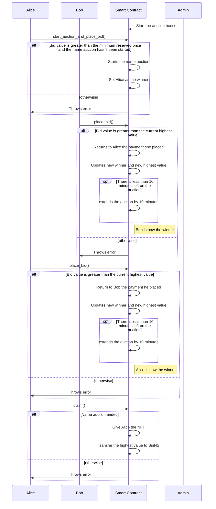

#### Sequence diagram for interaction of the auction
This diagram shows all the interaction between `Bidders`, `Smart Contract` and `Admin`.

```mermaid

sequenceDiagram
    participant Alice
    participant Bob
    participant SC as Smart Contract
    participant Admin
	Admin->>SC: Start the auction house

Alice->>SC: start_auction_and_place_bid()
alt Bid value is greater than the minimum reserved price and the name auction hasn't been started
    SC->>SC: Starts the name auction
    SC->>SC: Set Alice as the winner
else otherwise
    SC->>Alice: Throws error
end

Bob->>SC: place_bid()
alt Bid value is greater than the current highest value
    SC->>SC: Returns to Alice the payment she placed
    SC->>SC: Updates new winner and new highest value
    opt There is less than 10 minutes left on the auction
    SC->>SC: extends the auction by 10 minutes
end
Note right of SC: Bob is now the winner
else otherwise
    SC->>Bob: Throws error
end

Alice->>SC: place_bid()
alt Bid value is greater than the current highest value
    SC->>SC: Return to Bob the payment he placed
    SC->>SC: Updates new winner and new highest value
    opt There is less than 10 minutes left on the auction
    SC->>SC: extends the auction by 10 minutes
end
Note right of SC: Alice is now the winner
else otherwise
    SC->>Alice: Throws error
end

Alice->>SC: claim()
alt Name auction ended
    SC->>SC: Give Alice the NFT
    SC->>SC: Transfer the highest value to SuiNS
else otherwise
    SC->>Alice: Throws error
end

```
